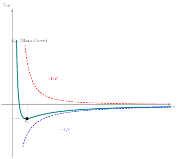
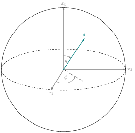
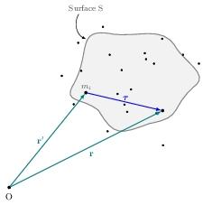

# TikZ Figure Collection

This is a collection of **TikZ figures** that I made for physics. The goal is to provide ready-to-use and customizable figures for academic and personal projects.

---

## Features

- Each figure is written as a **standalone** `.tex` file.
- You can easily customize these figures by editing the `.tex` files.

---
## How to Use

1. Browse the table below and pick a figure.
2. Open the corresponding `.tex` file in your favorite LaTeX editor.
3. Customize it if needed:
   - Change labels, colors, or sizes to fit your project.
4. Compile the file to generate a PDF of the figure:
   ```bash
   pdflatex filename.tex
   ```

5.	Convert the PDF to PNG or SVG using your favorite tool:
	  •	For PNG:
    ```bash
    magick filename.pdf filename.png
    ```
   •	For PNG:
    ```bash
    pdf2svg filename.pdf filename.svg
    ```


---

## Figures

Here are some figures you can use. I will be adding more figs on a regular basis.

| Figure Name                             | Preview                                  | 
|-----------------------------------------|------------------------------------------|
| `veff-main-curve.tex`                   |   | 
| `bloch-sphere.tex`                      |      |
| `surface-s-vector.tex`                  |  | 
| `empty-slot.tex`                        | *Empty space for future addition*        | 
| `empty-slot.tex`                        | *Empty space for future addition*        | 
| `empty-slot.tex`                        | *Empty space for future addition*        | 


---

## Customization Tips

These figures are highly customizable to suit your specific needs:
### 1.	Change Colors:

 
### 2. Resize Figures:

### 3. Edit Labels


### 4. Modify Line Styles


### 5. Adjust Shapes


### 6. Add or Remove Arrows

